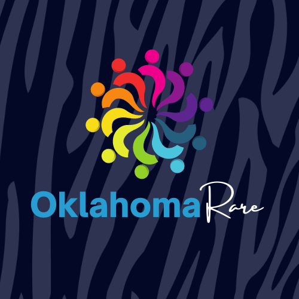

<!--
*** Thanks for checking out the Best-README-Template. If you have a suggestion
*** that would make this better, please fork the repo and create a pull request
*** or simply open an issue with the tag "enhancement".
*** Don't forget to give the project a star!
*** Thanks again! Now go create something AMAZING! :D
-->

<!-- PROJECT SHIELDS -->
<!--
*** I'm using markdown "reference style" links for readability.
*** Reference links are enclosed in brackets [ ] instead of parentheses ( ).
*** See the bottom of this document for the declaration of the reference variables
*** for contributors-url, forks-url, etc. This is an optional, concise syntax you may use.
*** https://www.markdownguide.org/basic-syntax/#reference-style-links
-->

<!-- PROJECT LOGO -->
 

  

<h3 align="center">Oklahoma Rare</h3>

  

    Oklahoma Rare is a non-profit advocacy group started by two parents of children with rare diseases. The goal of the organization is to promote community within the rare community and their families. This project is the final project during our time at Holberton, and we chose to create a React app to help people in the rare community manage day-to-day tasks. The application also includes information about the Oklahoma Rare organization, and allows for users to login and view their private tasks. 
     
    <a href="https://github.com/jashjchoi/ok_react_rare"><strong>Explore the docs »</strong></a>
     
     
    <a href="https://github.com/jashjchoi/ok_react_rare">View Demo</a>
    ·
    <a href="https://github.com/jashjchoi/ok_react_rare/issues">Report Bug</a>
    ·
    <a href="https://github.com/jashjchoi/ok_react_rare/issues">Request Feature</a>
  

<!-- TABLE OF CONTENTS -->

  
Table of Contents

  <ol>
    <li>
      <a href="#about-the-project">About The Project</a>
      <ul>
        <li><a href="#built-with">Built With</a></li>
      </ul>
    </li>
    <li>
      <a href="#getting-started">Getting Started</a>
    </li>
    <li><a href="#usage">Usage</a></li>
    <li><a href="#contributing">Contributing</a></li>
    <li><a href="#contact">Contact</a></li>
    <li><a href="#acknowledgments">Acknowledgments</a></li>
  </ol>

<!-- ABOUT THE PROJECT -->
## About The Project

[![Product Name Screen Shot][product-screenshot]](https://example.com)

This application is a todo application, including the ability for users to login and register using their Google accounts. This allows for a multi-user experience, and helps users to manage their individual tasks. 

(<a href="#top">back to top</a>)

### Built With

* [React.js](https://reactjs.org/)
* [Bootstrap](https://getbootstrap.com)
* [MaterialUI] (https://mui.com/)
* [Firebase] (https://firebase.google.com/)

(<a href="#top">back to top</a>)

<!-- GETTING STARTED -->
## Getting Started

This is an example of how you may give instructions on setting up your project locally.
To get a local copy up and running follow these simple example steps.

<!-- USAGE EXAMPLES -->
## Usage

The entry point for the application is the landing page. Here users can login or register using their Google account.
(screenshot)
Once a user is logged in, they can access the Dashboard. While on the Dashboard, users can create, edit, delete, and manage tasks in their calendar. Users can also create helpful tags to help track their events.
(screenshot)
If the user does not log into the application, they can view the About and Contact pages.
(screenshot)

_For more examples, please refer to the [Documentation](https://example.com)_

(<a href="#top">back to top</a>)

<!-- CONTRIBUTING -->
## Contributing

Contributions are what make the open source community such an amazing place to learn, inspire, and create. Any contributions you make are **greatly appreciated**.

If you have a suggestion that would make this better, please fork the repo and create a pull request. You can also simply open an issue with the tag "enhancement".
Don't forget to give the project a star! Thanks again!

1. Fork the Project
2. Create your Feature Branch (`git checkout -b feature/AmazingFeature`)
3. Commit your Changes (`git commit -m 'Add some AmazingFeature'`)
4. Push to the Branch (`git push origin feature/AmazingFeature`)
5. Open a Pull Request

(<a href="#top">back to top</a>)

<!-- CONTACT -->
## Contact

Jasmine Choi - [linkedin-url](https://www.linkedin.com/in/jasmine-hj-choi/) - jashjchoi@gmail.com
Ashley Price - [linkedin-url](https://www.linkedin.com/in/ashleybordenprice/) - email@email_client.com

Project Link: [https://github.com/jashjchoi/ok_react_rare](https://github.com/jashjchoi/ok_react_rare)

(<a href="#top">back to top</a>)

<!-- MARKDOWN LINKS & IMAGES -->
<!-- https://www.markdownguide.org/basic-syntax/#reference-style-links -->
[contributors-shield]: https://img.shields.io/github/contributors/github_username/repo_name.svg?style=for-the-badge
[contributors-url]: https://github.com/github_username/repo_name/graphs/contributors
[forks-shield]: https://img.shields.io/github/forks/github_username/repo_name.svg?style=for-the-badge
[forks-url]: https://github.com/github_username/repo_name/network/members
[stars-shield]: https://img.shields.io/github/stars/github_username/repo_name.svg?style=for-the-badge
[stars-url]: https://github.com/github_username/repo_name/stargazers
[issues-shield]: https://img.shields.io/github/issues/github_username/repo_name.svg?style=for-the-badge
[issues-url]: https://github.com/github_username/repo_name/issues
[license-shield]: https://img.shields.io/github/license/github_username/repo_name.svg?style=for-the-badge
[license-url]: https://github.com/github_username/repo_name/blob/master/LICENSE.txt
[linkedin-shield]: https://img.shields.io/badge/-LinkedIn-black.svg?style=for-the-badge&logo=linkedin&colorB=555
[linkedin-url]: https://linkedin.com/in/linkedin_username
[product-screenshot]: images/screenshot.png
